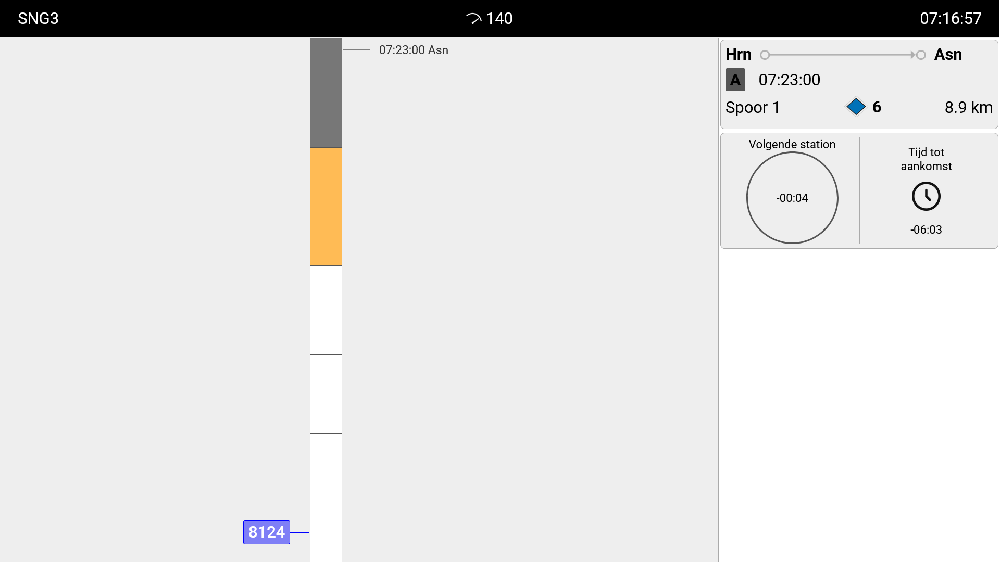

# TIMTIM-like Interface as used by NS for Zwolle-Groningen DLC of Train Sim World

NS TIMTIM Interface for Zwolle-Groningen DLC of Train Sim World

## Features

- Route ribbon with timetable integration and information on signals
- Coasting advice
- TIM(T)IM Pro

## Prerequisites

- TSW6 Build 493 (API 1.5)
- Zwolle-Groningen route DLC

## Setup

For reference on the API (key), see [the API manual on the DTG forum](https://forums.dovetailgames.com/attachments/tsw-external-interface-api-1-5-1-pdf.203411/).

### Get API key

- Set TSW to launch with the `-HTTPAPI` flag option.
- With this in place, load the game up to the main menu once and then exit.
- Go to `Documents\My Games\TrainSimWorld6\Saved\Config` in your file system/user profile folder
- Copy the API key from `CommAPIKey.txt`. And close the file without saving changes.
- Create the file and paste the key in /assets/scripr/api-key.js:1 in this project.

### Usage

- Launch TSW with the `-HTTPAPI` flag option.
- Serve the project root folder with PHP development server or an alternative.
- Navigate to `http://localhost:[server-port]?tr=runningNumber&len=carriages`, where `runningNumber` is the service you are playing, and `carriages` is the amount of carriages your EMU has in total.

## How does it work?

To provide you with accurate information, this applet reads data about the current game (like in-game time, speed limit and position) and combines it with real-life data like timetables and coasting data.
The interface of this applet is strictly based on the interface used by Dutch railway operator NS in their active operations (TIMTIM Pro with Routelint).
